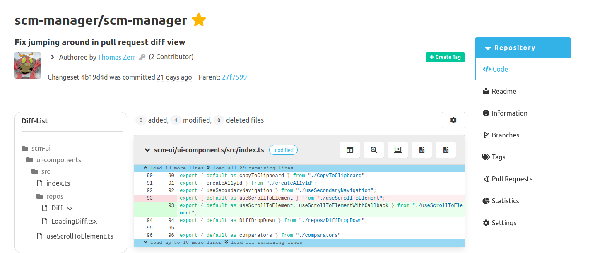

Dear SCM-Manager Community,

today we released the new version of the SCM-Manager 3.5.0.
In this release cycle, we continued on improving the user experience of working with pull requests and changesets.
Furthermore, this release also provides new features and bugfixes in the core, "Review Plugin" and the newly released "Documentation Viewer Plugin". 

## New File Tree in the Changeset and Diff Views

To improve the handling of changesets and pull requests with a huge amount of file changes,
we added a file tree to support users navigating through the changeset and diff view.

This file tree allows users to have a better overview of all the files, that are changed by changeset or a pull request.
Each file can also be used as an anchor, to jump to the diff of the corresponding file.
It also forces the loading of that diff, if it has not been loaded yet.
Future releases will polish the file tree further, by adding features to accommodate the different workflows of different users.
User feedback for this feature is highly appreciated.

## Documentation Viewer Plugin

It is pretty common that the documentation of a repository is contained within the repository itself.
To improve the handling of those documentation files, we started to develop the "Documentation Viewer Plugin".
The goal of this plugin is to make the user experience of viewing and editing the documentation as easy as possible.
The first release offers a quick access link at the repository sidebar navigation to the documentation itself.

For further information on how to use this plugin, take a look at the [plugin documentation page.](/plugins/scm-documentation-viewer-plugin/docs)
In the next release cycle, we will focus on improving the editing experience by implementing a rich markdown editor.

## Conflicting Files in the Pull Request Diff View

If a pull request contains conflicting changes,
a user would need to navigate to the "Conflict" tab to see which files are affected by a conflict.
This might require a user to jump back and forth between the "Diff" and "Conflict" tab to conduct his review.
We solved this issue, by also indicating with a warning icon which files contain a conflict within the "Diff" tab.

## Improved Performance for Pull Request Overview

The SCM-Manager team is currently also focusing on improving the performance of the SCM-Manager.
In the course of pursuing this goal, we started by optimizing the response time of the pull request overview page.
We noticed a huge hit to the response time, 
if users tried to load all pull requests of a repository (tested with over 300 pull requests).
The pagination did not curtail the response time.
This issue occurred due to a lackluster implementation of the corresponding endpoint.
We fixed the implementation issues and reduced the response time by a significant amount.

If you find any performance related issues, please notify us either on [GitHub](https://github.com/scm-manager/scm-manager/) or our [community platform](https://community.cloudogu.com/c/scm-manager/).

## Closing Words

Are you still missing an important feature? How can SCM-Manager help you improve your work processes?
We would love to hear from you about what you need most!

Do you have any questions or suggestions about the SCM-Manager?
Contact the DEV team directly on [GitHub](https://github.com/scm-manager/scm-manager/) and make sure
to check out our new [community platform](https://community.cloudogu.com/c/scm-manager/).
