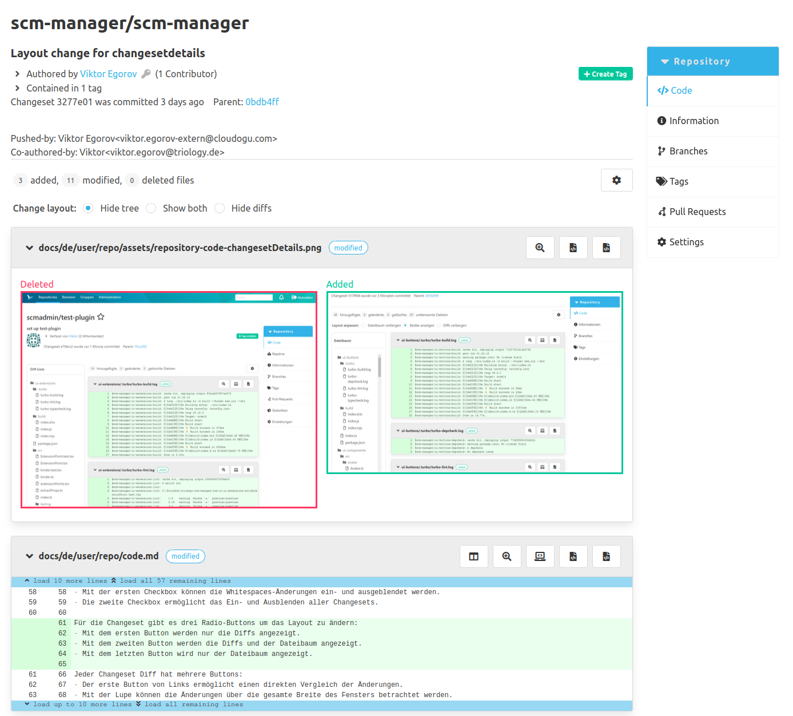
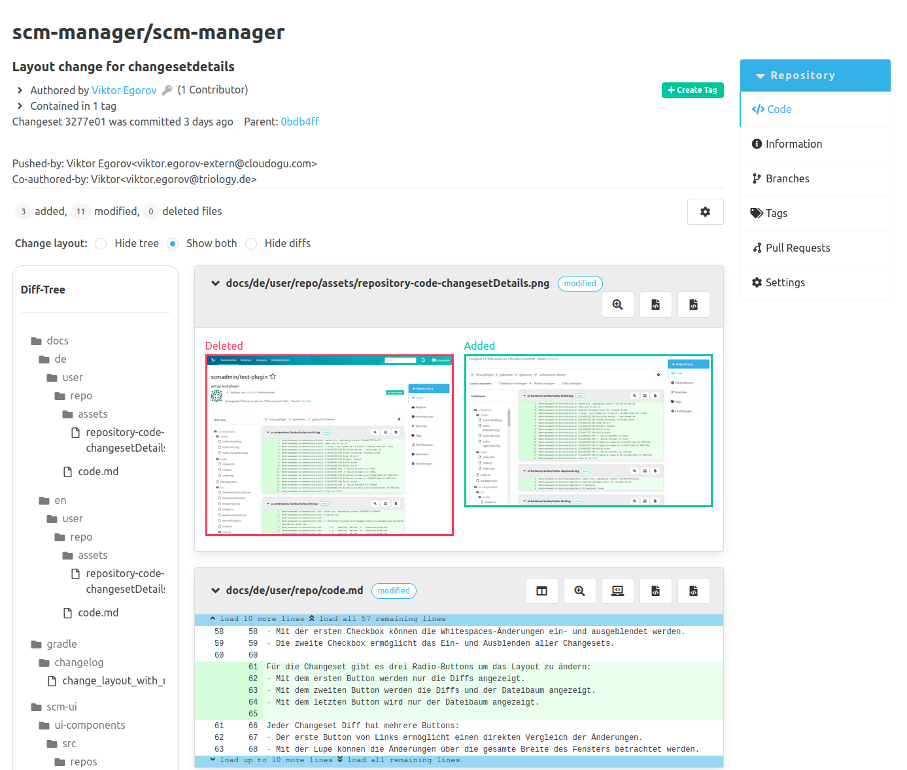
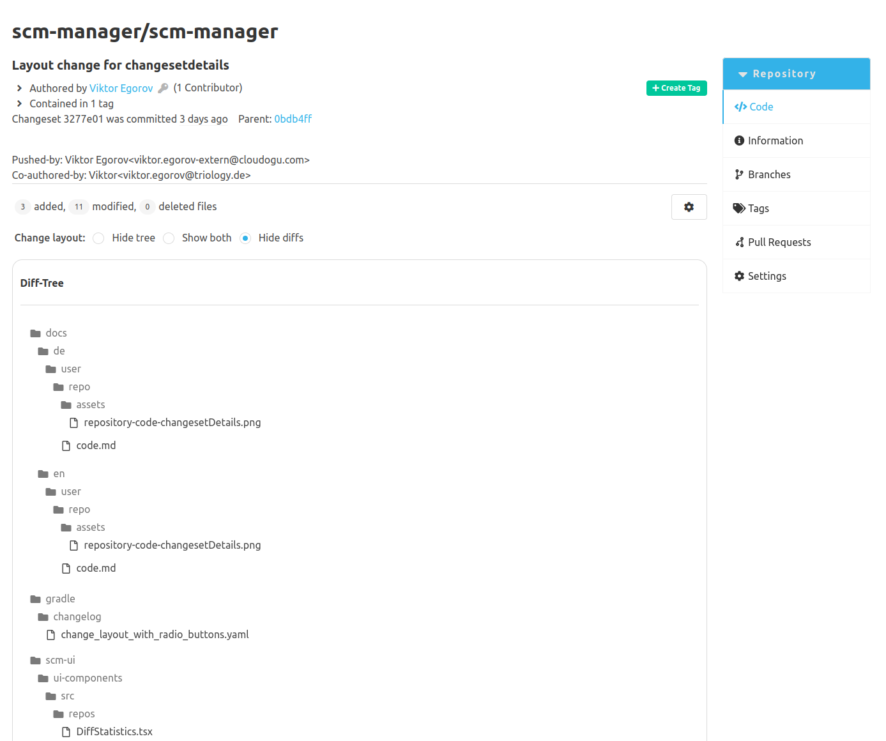
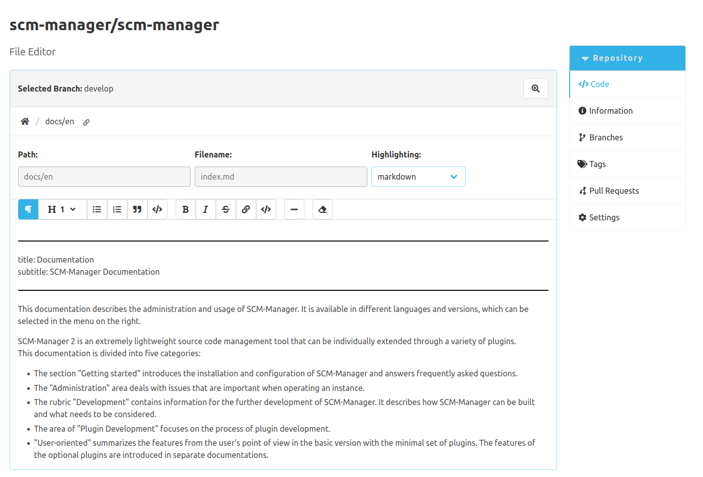
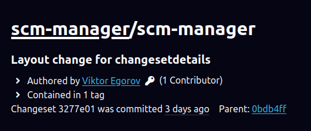

Dear SCM-Manager Community,

today we released the new version of the SCM-Manager 3.6.0.
In this release cycle, we focused on improving upon already implemented features. 
For example, we worked on the layout of the changeset and diff view,
the editing experience of markdown documentation, and the general accessibility of our webapp.
This release also includes other new features and bugfixes for the core and the following plugins:

- Documentation Viewer Plugin
- Review Plugin
- Tag Protection Plugin
- Readme Plugin
- Support Plugin
- Repository Size Plugin
- Pushlog Plugin
- Editor Plugin
- Gotenberg Plugin
- Trace Monitor Plugin

## New Layouts in the Changeset and Diff Views

The previous release added a file tree containing every file changed by a commit or a pull request.
Based on the feedback we received from users, we added the ability to change the layout of the file tree and the diffs.
It is now possible to switch between three layout modes using a radio group at the top.

The first mode hides the file tree and only shows the file diffs.
This improves the handling of diffs containing long lines of code.

The second mode shows the file tree and the file diffs.
Allowing quick navigation between file diffs while reviewing them.

The third mode hides the file diffs and only shows the file tree.
This improves the handling of files with a long path and filename.
The navigation to a specific file also works in this mode.
After jumping to a file, the layout mode changes to show both file tree and file diffs.

## New Markdown Editor

In the previous blog post we already announced a rich text editor for editing markdown files.
With this release the new editor is now officially published.
It is available through the newest version 1.1.0 of the ["Documentation Viewer Plugin"](/plugins/scm-documentation-viewer-plugin/docs).

This editor provides a rendered view of the current markdown document and a toolbar to format selected text.
Besides tables, it supports the complete basic markdown syntax.
To get an overview over all available features, you should take a look at the [plugin documentation](/plugins/scm-documentation-viewer-plugin/docs).

For future releases we are planning to add syntax highlighting for code blocks, support of tables and an additional source view.

## Accessibility Improvements

Accessibility is an important and serious topic for the developer team.
Therefore, we wanted to highlight some of the work we put in to improve it.
We started by optimising the handling of our webapp by assistive technologies like a screen reader.
To achieve this we started changing our HTML structure slightly to better utilize the semantics of HTML elements and also
added some aria attributes to certain elements.

The high contrast mode also got some redesigns to better adhere to accessibility design guidelines.
For example links are now underlined and therefore easier to distinguish from basic text.

## Closing Words

Are you still missing an important feature? How can SCM-Manager help you improve your work processes?
We would love to hear from you about what you need most!

Do you have any questions or suggestions about the SCM-Manager?
Contact the DEV team directly on [GitHub](https://github.com/scm-manager/scm-manager/) and make sure
to check out our new [community platform](https://community.cloudogu.com/c/scm-manager/).
