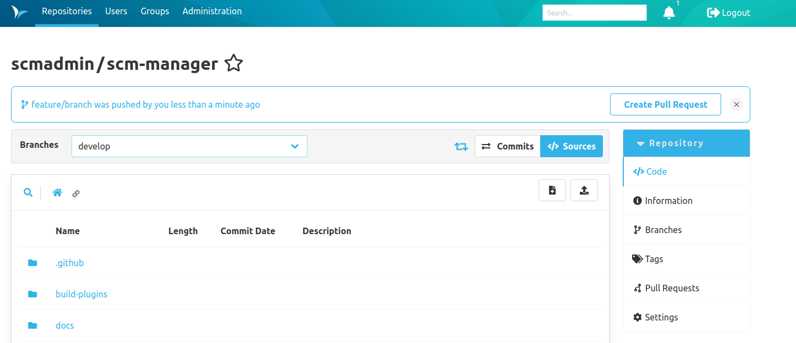

Dear SCM-Manager Community,

today we released the new version of the SCM-Manager 3.7.0.
In this release cycle, we focused on improving the handling of git repositories by optimizing the performance of git modifications via UI and enabling the usage of partial clones and fetches.
We also improved the user experience of creating pull requests.
This release also includes other new features and bugfixes for the core and the following plugins:

- Review Plugin
- Repository Avatar Plugin
- Landing Page Plugin
- Jira Plugin
- Webhook Plugin
- Repository Size Plugin
- Repository Mirror Plugin

## Performance Improvements for Git Modifications

With the previous implementation of commits via UI, it was required for the SCM-Manager to locally clone a repository within the working directory to apply the changes of a commit.
The commit was then created after applying those changes and pushed to the actual repository.
The biggest bottleneck of this approach was the cloning of the repository, because it heavily depended on the size of the repository.
At first, we tried to improve this issue by caching a cloned repository.
But this only helped marginally, because it required the repository to already be cached, and it did not help at all when merging pull requests.

This release contains a new approach.
Instead of relying on a cloned repository, for the creation of the commits for us, we started to create the commits ourselves with the help of the [JGit](https://www.eclipse.org/jgit/) library.
Because of this approach we achieved a drastic improvement in terms of speed.
Now the creation of a commit via UI does not depend on the size of the affected repository.

If you still notice poor performance regarding commits, please contact us via [GitHub](https://github.com/scm-manager/scm-manager/) or our [community platform](https://community.cloudogu.com/c/scm-manager/).

## Partial clones and fetches for Git Repositories 

Git supports partial clones or fetching of a remote repository.
However, it requires the repository to configure the property `uploadpack.allowFilter` with `true`.
We have now enabled this property for all git repositories so that clients may use this feature.
It does not matter if the repository is newly created after the update or already existed before the update.

## Banner with Pull Request Suggestions

We added suggestions to create pull requests for a recently pushed source branch, to further improve the user workflow when working with pull requests.
These suggestions are shown in banners rendered below the title of a repository view.
Each banner contains the information which branch was recently pushed by the current user, a button to quickly navigate to the create pull request view with the respective branch preselected as the source branch and a button to delete the suggestion itself.
Please take a look at the [review plugin documentation](/plugins/scm-review-plugin/docs/3.7.x/en/create-pr/) for further information.

## Closing Words

Are you still missing an important feature? How can SCM-Manager help you improve your work processes?
We would love to hear from you about what you need most!

Do you have any questions or suggestions about the SCM-Manager?
Contact the DEV team directly on [GitHub](https://github.com/scm-manager/scm-manager/) and make sure
to check out our [community platform](https://community.cloudogu.com/c/scm-manager/).
