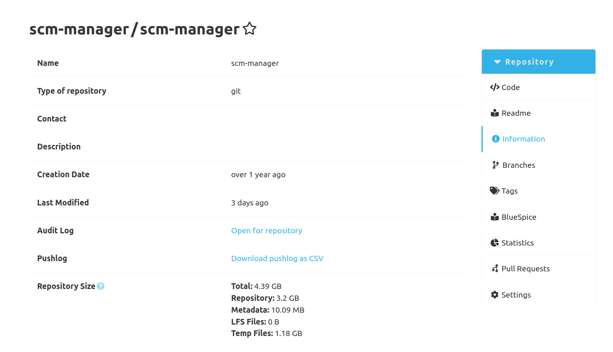
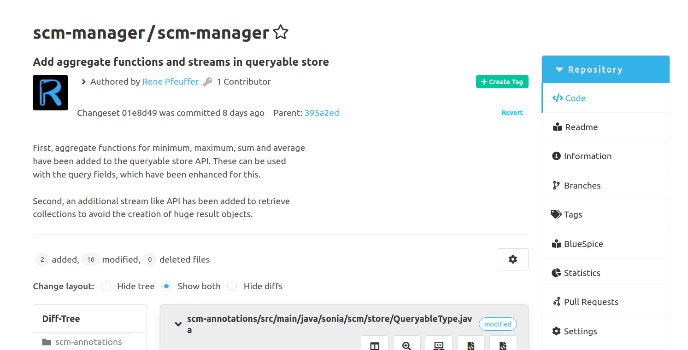
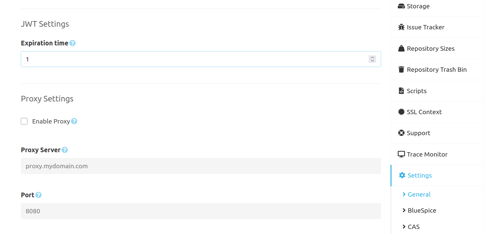

Dear SCM-Manager Community,

today we released version 3.8.0 of the SCM-Manager.
In this release cycle, we focused on finishing the implementation for the SQLite support mentioned in our previous blog post [here](../2025-03-11-jwt-configuration-and-sqlite-support/index.md).
We also reimplemented parts of the Pushlog Plugin, so it now uses SQLite for persisting its data.
Besides those big changes, we also added new features and improved upon existing ones.

## Pushlog Plugin with SQLite Support

In the past, we have experienced performance problems regarding the Pushlog plugin with repositories that have a high number of commits.
We were able to trace these performance problems back to our XML-based persistence layer in the SCM-Manager.
To get these problems under control, we switched the persistence layer of the Pushlog plugin to our SQLite API.
This means that loading Pushlog entries should no longer lead to slow loading times, even with larger repositories.
 
To benefit from this update, simply upgrade the SCM-Manager to version 3.8.0 and install the latest version of the Pushlog plugin.
Previous Pushlog entries do not have to be migrated manually, this happens automatically when the SCM-Manager is started.
When importing and exporting repositories, these Pushlog entries are also retained and are automatically migrated to SQLite.

## Export of Pushlog Entries

In addition to the performance improvements, we have also implemented a new feature for the Pushlog plugin.
With the latest version of the Pushlog plugin it is now also possible to download all Pushlog entries of a repository as a CSV file.
The download link for this CSV file can be found on the information page of each repository.
This CSV contains for each commit of the repository the time when this commit was pushed and by which user.

## Commit Reverts

In everyday developer life, it occasionally happens that commits are created and pushed, that you want to revert again at a later point in time. 
The version control system Git supports this with the following command `git revert <commit>`.
To better support this process, we now also offer the option of reverting a specific commit in the UI of the SCM Manager.
For this purpose, a button has been introduced in the details view of a commit which, when clicked, reverts the respective commit and then redirects the user to the new commit with the removed changes.

## Configuration of JWT Lifetimes

JWTs are used in the SCM-Manager to authenticate users.
These usually have a limited lifetime. 
In the case of the SCM-Manager, this was previously limited to one hour.
This meant that users were forced to log in again after a certain period of inactivity.
Several feature requests from the community have made us aware that there is a need to make the lifetime of a JWT configurable and thus reduce the frequency with which users have to log in again.
We have responded to those requests from the community and have now made it possible to specify a lifetime for JWTs in hours in the general settings of the SCM-Manager.
We ask you to use this feature with caution, as a longer JWT lifetime also represents a security risk.

## Closing Words

Are you still missing an important feature? How can SCM-Manager help you improve your work processes?
We would love to hear from you about what you need most!

Do you have any questions or suggestions about the SCM-Manager?
Contact the DEV team directly on [GitHub](https://github.com/scm-manager/scm-manager/) and make sure
to check out our [community platform](https://community.cloudogu.com/c/scm-manager/).
