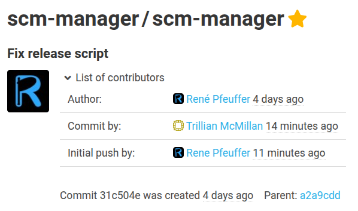

Dear SCM-Manager Community,

a few days ago we released version 3.9.0 of the SCM-Manager.
This release is a continuation of our efforts to improve the performance using SQLite. While migrating some
more plugins to the new persistence layer, we noticed that we needed some more features.
But you will also find some other minor changes in this release that address some of the community's issue reports.

## Changes in the core

When the development of SCM-Manager started many years ago, the word 'changeset' was being used a lot more often than it
is today. Now, the term 'commit' is omnipresent in the world of version control systems. We have therefore decided to 
rename the term 'changeset' to 'commit' in SCM-Manager.

We often receive feedback that the deletion of a repository is too easy. In the administration view of a repository,
deletion is only one click away. To address this, we have added a confirmation dialog where the name of the repository
has to be typed in once more when deleting a repository. This should help prevent accidental deletions of repositories.

Another little change affects the commit details view. We realized that we were inconsistent regarding the timestamps
of the different 'events' of a commit. In Git, a commit can have an 'author' referring to the person who wrote the code,
while the term 'committer' refers to the person who actually created the commit. This can be different people and
it can happen at different times, for example when a commit is rebased or cherry-picked. We have therefore clarified
this by displaying the times alongside the author and the committer.

## Further plugins using the new persistence layer

As mentioned above, we have migrated some more plugins to the new persistence layer. This time, the following
plugins have been migrated:

- Review Plugin
- Landingpage Plugin
- Trace Monitor Plugin

This should result in a better performance when using these plugins and increased stability of the SCM-Manager.

## Closing Words

Especially with the migration of the plugins to the new persistence layer, we have made significant progress. On the
other hand, these had been big changes. So we are looking forward to your feedback on this release. Do not hesitate to
report any issues you encounter or share your thoughts on the changes.

Are you still missing an important feature? How can SCM-Manager help you improve your work processes?
We would love to hear from you about what you need most!

Do you have any questions or suggestions about the SCM-Manager?
Contact the DEV team directly on [GitHub](https://github.com/scm-manager/scm-manager/) and make sure
to check out our [community platform](https://community.cloudogu.com/c/scm-manager/).
