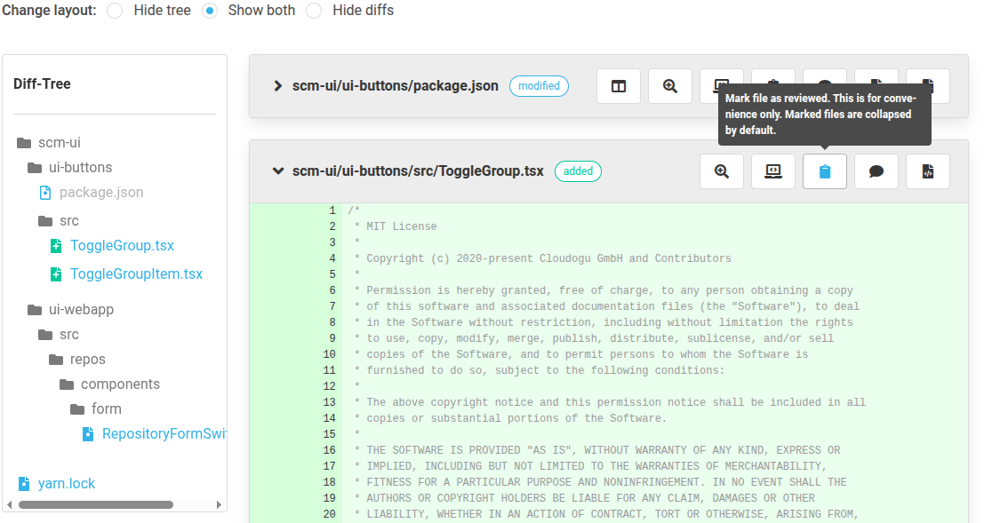

Dear SCM-Manager Community,

At the end of last week, we released SCM-Manager version 3.11.0. This release wasn't actually planned yet;
however, we recently made a mistake that we have corrected with this release.

Unfortunately, we accidentally published a release of our development version, where we are working on a
big frontend library update (the adaptations for React 19). We sincerely apologize
to everyone who experienced problems as a result. This should not have happened. Luckily, this release
only contained changes to the user interface, so there is no risk of data loss.

Nevertheless, we have two interesting new features to announce with this release, too.

## MCP Server

For all those who like to experiment with AI, we can recommend taking a look at our new MCP Plugin.
This implements an MCP server with initial tools for the SCM-Manager (listing repositories,
creating repositories, creating or changing files in a repository, as well as a global search).
After installing the plugin, the server is available under the URL path `/scm/api/mcp`. A normal API
token is required for login. In our initial tests, the AI handled these functions well.

## Marking Reviewed Files

In the review plugin, it has long been possible to mark files in the diff of a pull request as "reviewed".
This marking is now also reflected in the file tree, so that with larger changes, there is a better overview
of what has not yet been reviewed.

## Closing Words

We would appreciate feedback on both features. 
Do not hesitate to report any issues you encounter or share your thoughts on the changes.

Are you still missing an important feature? How can SCM-Manager help you improve your work processes?
We would love to hear from you about what you need most!

Do you have any questions or suggestions about the SCM-Manager?
Contact the DEV team directly on [GitHub](https://github.com/scm-manager/scm-manager/) and make sure
to check out our [community platform](https://community.cloudogu.com/c/scm-manager/).
