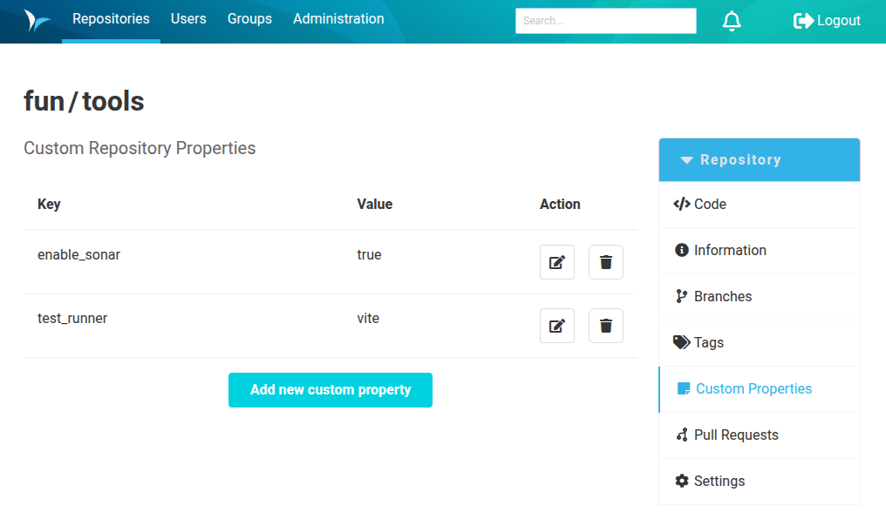
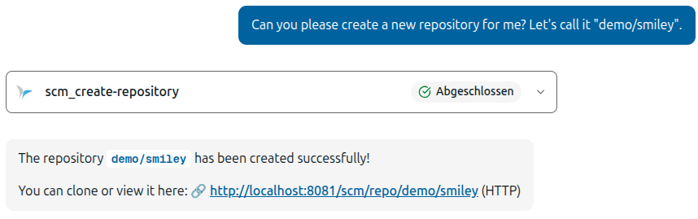
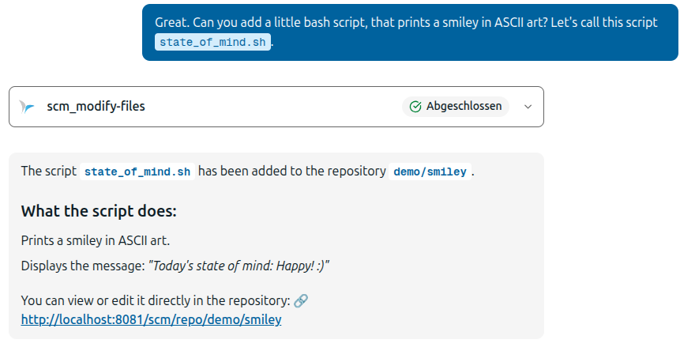
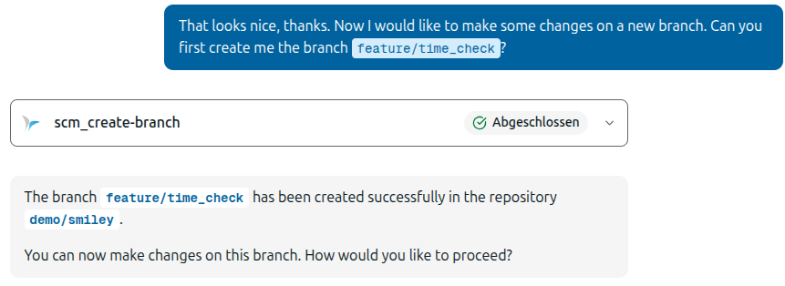
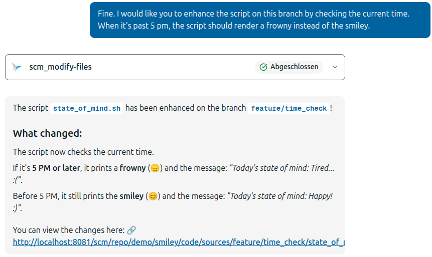
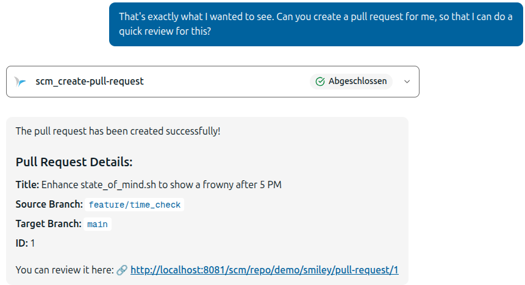
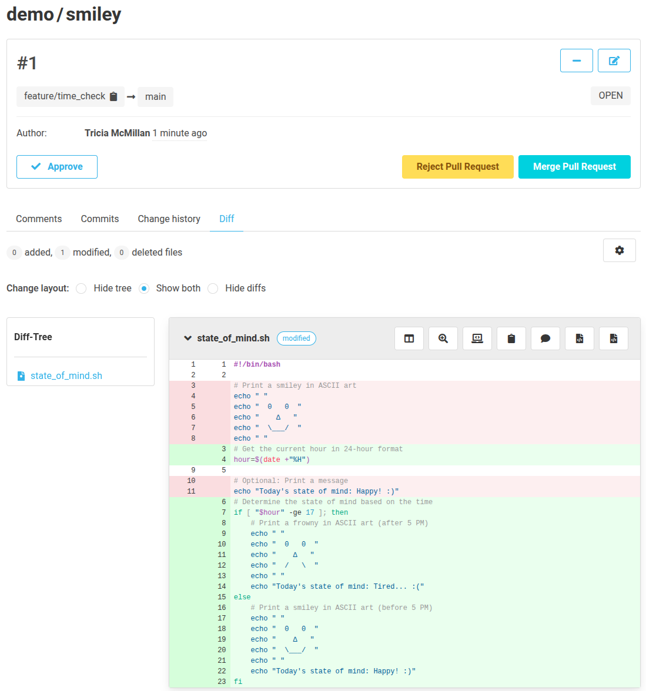

Dear SCM-Manager Community,

It's been a while since you heard from us, but we haven't been idle. While a lot of our capacity
is currently going into migrating our frontend from React 17 to React 19, we still managed to develop
some nice features we would like to introduce to you.

## Custom Properties Plugin

You can now install the [Custom Properties Plugin](https://scm-manager.org/plugins/scm-custom-properties-plugin/docs/1.4.x/en/overview/).

In the simplest case, you can use it to manage your repositories by applying custom properties as tags.
However, you can also use them to configure your Jenkins builds.

If you are using build libraries, you can now influence them using custom properties that are read by build pipelines
as environment variables. For example, you could disable specific build stages based on a boolean property, or run
different commands depending on whether a project uses Jest or Vitest.

## MCP Server

In the last post, we mentioned the new [MCP Plugin](https://scm-manager.org/plugins/scm-mcp-plugin/docs/latest/en/).

We have now brought it from a proof of concept to a fully useful tool. It can also be extended by other plugins,
such as the Review Plugin, which adds functionality to search for pull requests and comments, or to create new pull requests.

Want to let an AI handle repetitive tasks, like updating licenses in a repository? Just tell it to create a new branch,
execute the changes, and create a pull request when it's finished. All you have to do at the end is review the result.

Here are some screenshots of a litte experiment:

## Closing Words

We would appreciate feedback on both features. 
Do not hesitate to report any issues you encounter or share your thoughts on the changes.

Are you still missing an important feature? How can SCM-Manager help you improve your work processes?
We would love to hear from you about what you need most!

Do you have any questions or suggestions about the SCM-Manager?
Contact the DEV team directly on [GitHub](https://github.com/scm-manager/scm-manager/) and make sure
to check out our [community platform](https://community.cloudogu.com/c/scm-manager/).
