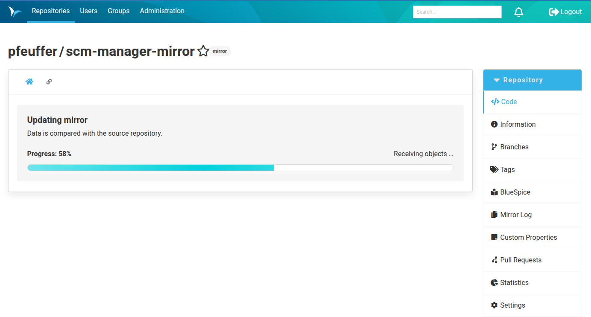

Dear SCM-Manager Community,

Yes, we're still here! We are also still working on our React update, although the hardest part now seems to be behind us.
In the meantime, after a series of smaller bug-fix releases, we have released SCM-Manager 3.12.0 today.
This release will be particularly interesting to those of you who use the Repository Mirror Plugin, which has received
some major improvements.

## Repository Mirror Plugin

Until now, the Repository Mirror Plugin has not provided much feedback. When creating or updating a mirror, you could
not really see what was happening behind the scenes. This changes with version 3.3.0 of the plugin: A new progress bar
shows both the overall progress and the step currently being performed, much like the output of a Git clone or pull.

We have also added a button to the mirror settings that updates only the LFS files. This action works even if LFS support
is disabled in the mirror configuration, making it easier to recover when something has gone wrong. Working
with LFS files can still be a little tricky, so we hope this gives you a useful way to resolve problems. You may also
notice that checking for LFS files is now significantly faster.

## Closing Words

We would appreciate your feedback on these improvements.
Do not hesitate to report any issues you encounter or share your thoughts on the changes.

Are you still missing an important feature? How can SCM-Manager help you improve your work processes?
We would love to hear from you about what you need most!

Do you have any questions or suggestions about SCM-Manager?
Contact the development team directly on [GitHub](https://github.com/scm-manager/scm-manager/) and make sure
to check out our [community platform](https://community.cloudogu.com/c/scm-manager/).
