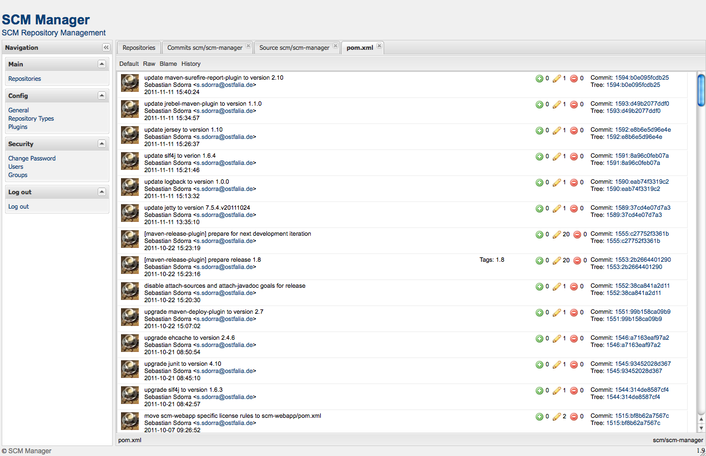

Version 1.9 of SCM-Manager is now available for download.

**Download**: [https://bitbucket.org/sdorra/scm-manager/wiki/download](https://bitbucket.org/sdorra/scm-manager/wiki/download "Download")  
**Release notes**: [https://bitbucket.org/sdorra/scm-manager/wiki/release-notes](https://bitbucket.org/sdorra/scm-manager/wiki/release-notes "Release Notes")  
**Getting started**: [https://bitbucket.org/sdorra/scm-manager/wiki/getting-started](https://bitbucket.org/sdorra/scm-manager/wiki/getting-started "Getting started")

**Screenshots:**

