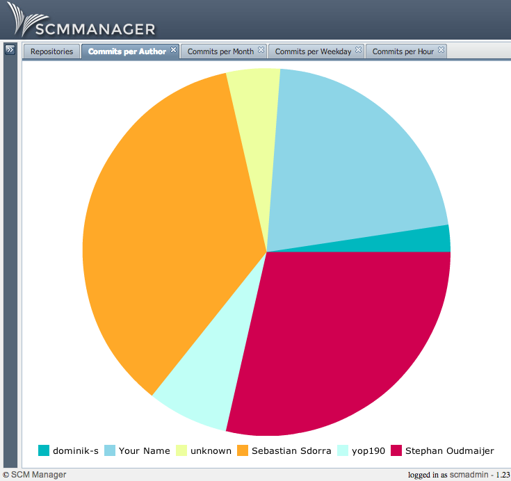
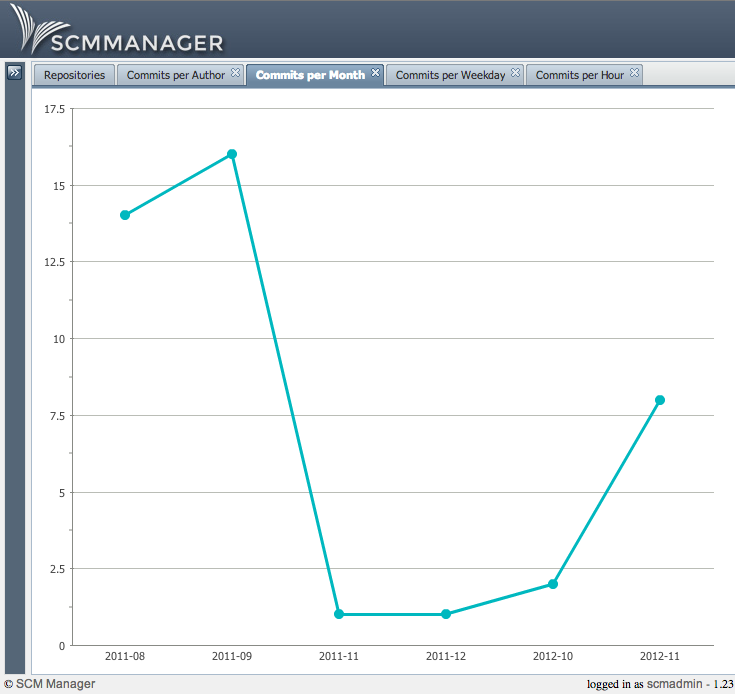
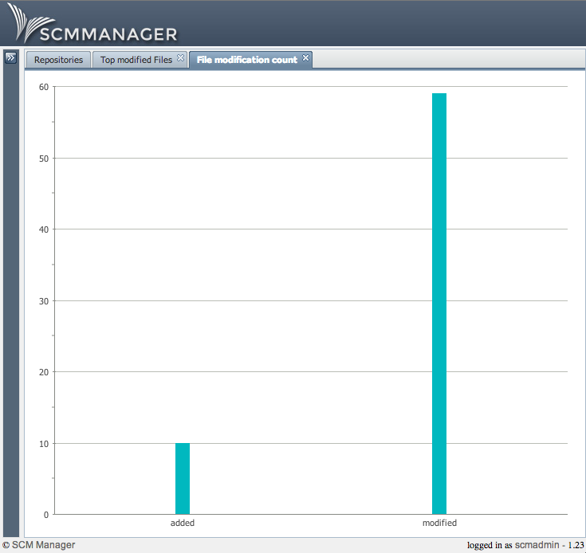

Build statistics for every repository in SCM-Manager.

**Source**: <a title="scm-statistic-plugin" href="https://bitbucket.org/sdorra/scm-statistic-plugin" target="_blank">https&#x3A;//bitbucket.org/sdorra/scm-statistic-plugin  <strong>S</strong></a>**creenshots:  
** </pre>

